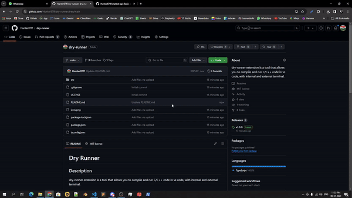

# Dry Runner

## Description
dry-runner extension is a tool that allows you to compile and run C,C++, Python, Java, PHP, Javascript code in vs code, with integreted terminal.

## Features
- Run C,C++, Python, Java, PHP, Javascript code with a single click
- Support Windows/Linux both
- Customizable execution path settings
- Output display for easy debugging
- 
<!-- > [!IMPORTANT]  
> This extension is currently in early development/experimental stage. There are few of unimplemented/broken features at the moment. Contributions are welcome to help out with the progress! -->

## Installation 
1. Open VS code Extension section
2. Search "dry-runner" from the search bar
3. click on dry runner extension 
3. click on install

## Usage
1. Open a supported file in your VS Code.
2. To run just click F5
3. You've Done

## Default Shortcut Key
- F5 : Start
- F5 : Restart
- F4 : Stop and close terminal

## Configuration
You can customize the behavior of the dry-runner extension by modifying the settings. To access the settings, go to the preferences menu of your code editor and search for "dry-runner".

## Contributing
Contributions are welcome! If you find any issues or have suggestions for improvements, please open an issue or submit a pull request on the dry-runner GitHub repository.

## License
This extension is licensed under the [MIT License](https://github.com/Hunter87ff/dry-runner/blob/main/LICENSE).

## Contact
For any questions or inquiries, please join our discord server : [Join Server](https://discord.gg/vMnhpAyFZm)
