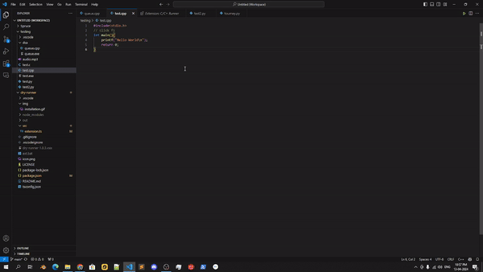

# Dry Runner

  
## Description
dry-runner extension is a tool that allows you to compile and run C,C++, Python, Java, PHP, Javascript, TypeScript, Dart, Kotlin,Batch script, Shell script and much more in vs code, with integreted terminal.

## Features
- Run C,C++, Python, Java, PHP, Javascript, Kotlin and many more with a single click
- Support Windows/Linux both
- Customizable execution path settings
- Output display for easy debugging
- You can setup system environment(user mode)

<!-- > [!IMPORTANT]  
> This extension is currently in early development/experimental stage. There are few of unimplemented/broken features at the moment. Contributions are welcome to help out with the progress! -->

<!--  -->

## Installation 
1. Open VS code Extension section
2. Search "dry-runner" from the search bar and install
3. After successful installation you can customise executable path here!!
3. Well You've done installation

## Usage
1. Configure path if not configure. if you don't have admin perms to your system, you can also configure path here 
2. Open a supported file in your VS Code.
2. To run just click F5(you can change through settings)
3. You've Done

> [!NOTE]
> In case of java, the root class name (which contains the main method as an entry point) must be same as the java file name!!
> Otherwise it won't work!!

## Supported Langs and Files
- Java
- C/C++
- Dart
- Kotlin
- Python
- Javascript
- TypeScript
- Shell Script
- Batch Script
- Jar Files
- Java Class Files
- Exe Files

## Default Shortcut Key
- `F5` : Run Code
- `F5` : Restart
- `F4` : Stop and close terminal
- `Ctrl`+`Shift`+`F5` : Customize Environment Path(if don't have admin rights)

## Don't have permission to change executable(AKA environment) path?
1. You can download portable version of the program executables (only if no executable is already exist)
2. Then extract the portable (zip,7z,rar...)
3. Copy the bin path of the executable
4. Paste the path to the extension settings -> executable path (jdk,mingw,python, node, php etc.)
5. Restart vs code!! and done!!

## Want to add path to system environment but don't have admin rights?
1. Install dry runner on VS Code
2. Click `Ctrl`+`Shift`+`F5` (Default Shortcut)
3. Now you can change/add/delete system env path (user)

## Portables(Windows Supported)
- JDK : [JDK-22](https://www.oracle.com/java/technologies/javase/jdk22-archive-downloads.html)
- Python : [Python 3.10](https://github.com/Hunter87ff/dry-runner/releases/tag/1.0.6)
- Node :  [Node 18.18](https://github.com/Hunter87ff/dry-runner/releases/tag/1.0.6)
- PHP : [PHP 83.6](https://github.com/Hunter87ff/dry-runner/releases/tag/1.0.6)
- Dart Sdk : [Dart SDK v3.5.1](https://github.com/Hunter87ff/dry-runner/releases/tag/v1.0.71)
- MinGW : [MinGW64](https://github.com/Hunter87ff/dry-runner/releases/tag/v1.0.71) 

## Contributing
Contributions are welcome! If you find any issues or have suggestions for improvements, please open an issue or submit a pull request on the dry-runner GitHub repository.

## License
This extension is licensed under the [MIT License](https://github.com/Hunter87ff/dry-runner/blob/main/LICENSE).

## Contact
For any questions or inquiries, please join our discord server : [Join Server](https://discord.gg/vMnhpAyFZm)
